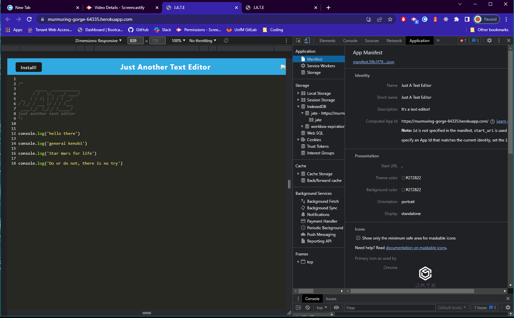
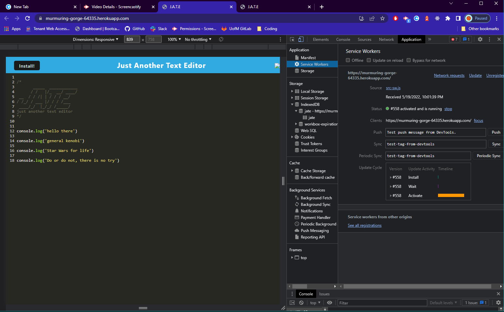

# Justa Text Editor  

[See the app in action](https://drive.google.com/file/d/18a89ik6fsdgBf2y6xkdZ-oyf1yhFt2v6/view)

## Table of Contents
- [Description](#description)
- [Installation](#installation)
- [How-To](#how-to)
- [Contribution](#contribution)
- [Testing Instructions](#testing-instructions)
- [Contact](#contact)
- [License](#license)
  
### [Description](#table-of-contents)

A single page application using IndexedDB and meets PWA standards. 
### [Installation](#table-of-contents)

To run the application you will need `Node.js`, as well as all of the dev-dependencies listed in the package-json files.

### [How-To](#table-of-contents)

[View the demo](https://drive.google.com/file/d/18a89ik6fsdgBf2y6xkdZ-oyf1yhFt2v6/view)

Once all the packages are installed, just type `npm run start` to get everything going.

### [Contribution](#table-of-contents)

Pull requests are welcome! For any major changes please open an issue.

### [Testing Instructions](#table-of-contents)

Install which ever test you prefer. 

### [Contact](#table-of-contents)

Questions?
Comments?
Concerns?
    
- [LSMarch](https://github.com/LSMarch)
- lsmarchetti01@gmail.com

   
    
### [License](#table-of-contents)
    
MIT License

Copyright (c) 2022 Libby Marchetti

Permission is hereby granted, free of charge, to any person obtaining a copy
of this software and associated documentation files (the "Software"), to deal
in the Software without restriction, including without limitation the rights
to use, copy, modify, merge, publish, distribute, sublicense, and/or sell
copies of the Software, and to permit persons to whom the Software is
furnished to do so, subject to the following conditions:

The above copyright notice and this permission notice shall be included in all
copies or substantial portions of the Software.

THE SOFTWARE IS PROVIDED "AS IS", WITHOUT WARRANTY OF ANY KIND, EXPRESS OR
IMPLIED, INCLUDING BUT NOT LIMITED TO THE WARRANTIES OF MERCHANTABILITY,
FITNESS FOR A PARTICULAR PURPOSE AND NONINFRINGEMENT. IN NO EVENT SHALL THE
AUTHORS OR COPYRIGHT HOLDERS BE LIABLE FOR ANY CLAIM, DAMAGES OR OTHER
LIABILITY, WHETHER IN AN ACTION OF CONTRACT, TORT OR OTHERWISE, ARISING FROM,
OUT OF OR IN CONNECTION WITH THE SOFTWARE OR THE USE OR OTHER DEALINGS IN THE
SOFTWARE.